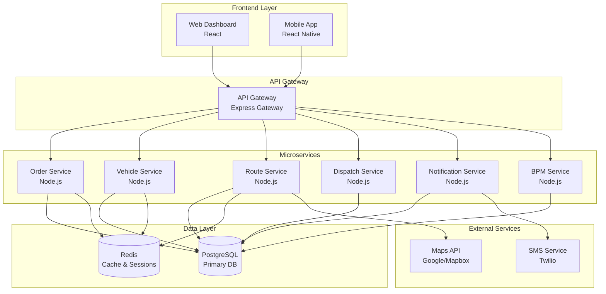
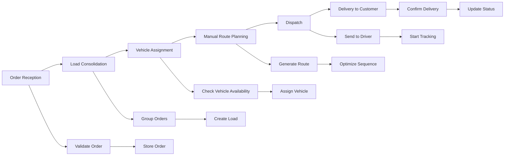

# Design Document - Last Mile Delivery System

## Overview

The Last Mile Delivery System is a comprehensive logistics platform designed to manage the complete delivery workflow from order reception to customer delivery. The system follows a microservices architecture with separate services for order management, route optimization, vehicle tracking, and customer communication.

The platform consists of:
- **Backend Services**: RESTful APIs built with Node.js/Express
- **Web Dashboard**: React-based administrative interface
- **Mobile App**: React Native driver application
- **Database**: PostgreSQL with Redis caching
- **Real-time Communication**: WebSocket connections for live updates

## Architecture

### System Architecture Diagram



### BPM Process Flow



## Components and Interfaces

### 1. Order Service

**Purpose**: Manages order lifecycle from creation to completion

**Key Components**:
- `OrderController`: Handles HTTP requests for order operations
- `OrderService`: Business logic for order processing
- `OrderRepository`: Data access layer for order persistence
- `OrderValidator`: Input validation and business rule enforcement

**API Endpoints**:
```
POST /api/orders - Create new order
GET /api/orders - List orders with filtering
GET /api/orders/:id - Get specific order
PUT /api/orders/:id - Update order
DELETE /api/orders/:id - Cancel order
GET /api/orders/:id/status - Get order status history
```

### 2. Vehicle Service

**Purpose**: Manages fleet vehicles and their availability

**Key Components**:
- `VehicleController`: Vehicle management endpoints
- `VehicleService`: Fleet management business logic
- `VehicleRepository`: Vehicle data persistence
- `CapacityCalculator`: Vehicle load capacity calculations

**API Endpoints**:
```
GET /api/vehicles - List available vehicles
POST /api/vehicles - Add new vehicle
PUT /api/vehicles/:id - Update vehicle details
GET /api/vehicles/:id/capacity - Check vehicle capacity
PUT /api/vehicles/:id/status - Update vehicle status
```

### 3. Route Service

**Purpose**: Handles route planning and optimization

**Key Components**:
- `RouteController`: Route management endpoints
- `RouteOptimizer`: Route calculation and optimization
- `MapService`: Integration with mapping APIs
- `RouteRepository`: Route data persistence

**API Endpoints**:
```
POST /api/routes - Create new route
GET /api/routes/:id - Get route details
PUT /api/routes/:id - Update route
POST /api/routes/:id/optimize - Optimize route sequence
GET /api/routes/:id/directions - Get turn-by-turn directions
```

### 4. Dispatch Service

**Purpose**: Manages dispatch operations and real-time tracking

**Key Components**:
- `DispatchController`: Dispatch management endpoints
- `DispatchService`: Dispatch business logic
- `TrackingService`: Real-time location tracking
- `WebSocketManager`: Real-time communication

**API Endpoints**:
```
POST /api/dispatch - Dispatch vehicle with route
GET /api/dispatch/active - List active dispatches
PUT /api/dispatch/:id/status - Update dispatch status
GET /api/dispatch/:id/tracking - Get real-time tracking data
POST /api/dispatch/:id/delivery - Record delivery completion
```

### 5. BPM Service

**Purpose**: Provides business process monitoring and visualization

**Key Components**:
- `BPMController`: BPM dashboard endpoints
- `ProcessAnalyzer`: Process flow analysis
- `MetricsCollector`: Performance metrics collection
- `DiagramGenerator`: Dynamic BPM diagram generation

**API Endpoints**:
```
GET /api/bpm/diagram - Get current process diagram
GET /api/bpm/metrics - Get process performance metrics
GET /api/bpm/bottlenecks - Identify process bottlenecks
GET /api/bpm/orders/:id/flow - Get order process flow status
```

## Data Models

### Core Entities

```typescript
// Order Entity
interface Order {
  id: string;
  customerId: string;
  customerName: string;
  customerPhone: string;
  deliveryAddress: Address;
  packageDetails: Package[];
  specialInstructions?: string;
  timeWindow?: TimeWindow;
  status: OrderStatus;
  createdAt: Date;
  updatedAt: Date;
}

// Vehicle Entity
interface Vehicle {
  id: string;
  licensePlate: string;
  type: VehicleType;
  capacity: VehicleCapacity;
  currentLocation?: Location;
  status: VehicleStatus;
  driverId?: string;
  createdAt: Date;
  updatedAt: Date;
}

// Load Entity
interface Load {
  id: string;
  orders: string[]; // Order IDs
  vehicleId?: string;
  totalWeight: number;
  totalVolume: number;
  status: LoadStatus;
  createdAt: Date;
  updatedAt: Date;
}

// Route Entity
interface Route {
  id: string;
  loadId: string;
  vehicleId: string;
  stops: RouteStop[];
  totalDistance: number;
  estimatedDuration: number;
  status: RouteStatus;
  createdAt: Date;
  updatedAt: Date;
}

// Dispatch Entity
interface Dispatch {
  id: string;
  routeId: string;
  vehicleId: string;
  driverId: string;
  status: DispatchStatus;
  startTime?: Date;
  completedTime?: Date;
  createdAt: Date;
  updatedAt: Date;
}
```

### Supporting Types

```typescript
interface Address {
  street: string;
  city: string;
  state: string;
  zipCode: string;
  coordinates: Location;
}

interface Location {
  latitude: number;
  longitude: number;
}

interface Package {
  id: string;
  description: string;
  weight: number;
  dimensions: Dimensions;
  fragile: boolean;
}

interface VehicleCapacity {
  maxWeight: number;
  maxVolume: number;
  maxPackages: number;
}

interface RouteStop {
  orderId: string;
  address: Address;
  sequence: number;
  estimatedArrival: Date;
  actualArrival?: Date;
  deliveryStatus?: DeliveryStatus;
  deliveryProof?: DeliveryProof;
}

interface DeliveryProof {
  signature?: string;
  photo?: string;
  notes?: string;
  timestamp: Date;
}
```

### Enums

```typescript
enum OrderStatus {
  PENDING = 'pending',
  CONSOLIDATED = 'consolidated',
  ASSIGNED = 'assigned',
  ROUTED = 'routed',
  DISPATCHED = 'dispatched',
  IN_TRANSIT = 'in_transit',
  DELIVERED = 'delivered',
  FAILED = 'failed',
  CANCELLED = 'cancelled'
}

enum VehicleStatus {
  AVAILABLE = 'available',
  ASSIGNED = 'assigned',
  IN_TRANSIT = 'in_transit',
  MAINTENANCE = 'maintenance',
  OFFLINE = 'offline'
}

enum LoadStatus {
  PENDING = 'pending',
  CONSOLIDATED = 'consolidated',
  ASSIGNED = 'assigned',
  DISPATCHED = 'dispatched',
  COMPLETED = 'completed'
}

enum RouteStatus {
  PLANNED = 'planned',
  OPTIMIZED = 'optimized',
  DISPATCHED = 'dispatched',
  IN_PROGRESS = 'in_progress',
  COMPLETED = 'completed'
}

enum DispatchStatus {
  PENDING = 'pending',
  ACTIVE = 'active',
  COMPLETED = 'completed',
  CANCELLED = 'cancelled'
}
```

## Error Handling

### Error Response Format

```typescript
interface ErrorResponse {
  error: {
    code: string;
    message: string;
    details?: any;
    timestamp: Date;
    requestId: string;
  };
}
```

### Error Categories

1. **Validation Errors** (400)
   - Invalid input parameters
   - Missing required fields
   - Business rule violations

2. **Authentication Errors** (401)
   - Invalid credentials
   - Expired tokens
   - Insufficient permissions

3. **Resource Errors** (404)
   - Order not found
   - Vehicle not found
   - Route not found

4. **Conflict Errors** (409)
   - Vehicle already assigned
   - Order already dispatched
   - Capacity exceeded

5. **System Errors** (500)
   - Database connection failures
   - External service failures
   - Unexpected system errors

### Error Handling Strategy

- **Graceful Degradation**: System continues operating with reduced functionality
- **Retry Logic**: Automatic retry for transient failures
- **Circuit Breaker**: Prevent cascade failures in microservices
- **Logging**: Comprehensive error logging for debugging
- **User Feedback**: Clear error messages for frontend users

## Testing Strategy

### Unit Testing
- **Coverage Target**: 80% code coverage minimum
- **Framework**: Jest for Node.js services
- **Focus Areas**:
  - Business logic validation
  - Data transformation functions
  - API endpoint handlers
  - Database operations

### Integration Testing
- **API Testing**: Test complete API workflows
- **Database Testing**: Test data persistence and retrieval
- **External Service Testing**: Mock external APIs (Maps, SMS)
- **WebSocket Testing**: Test real-time communication

### End-to-End Testing
- **User Journey Testing**: Complete order-to-delivery workflows
- **Cross-Platform Testing**: Web and mobile interface testing
- **Performance Testing**: Load testing for concurrent users
- **Mobile Testing**: Device-specific testing for mobile app

### Test Data Management
- **Test Database**: Separate database for testing
- **Data Fixtures**: Predefined test data sets
- **Data Cleanup**: Automated cleanup after tests
- **Mock Services**: Mock external dependencies

### Testing Environments
- **Development**: Local testing during development
- **Staging**: Pre-production testing environment
- **Production**: Limited production testing with monitoring

## Security Considerations

### Authentication & Authorization
- **JWT Tokens**: Stateless authentication
- **Role-Based Access**: Different permissions for different user types
- **API Key Management**: Secure API key storage and rotation

### Data Protection
- **Encryption**: Encrypt sensitive data at rest and in transit
- **PII Handling**: Secure handling of customer personal information
- **Data Retention**: Automated data cleanup policies

### API Security
- **Rate Limiting**: Prevent API abuse
- **Input Validation**: Sanitize all user inputs
- **CORS Configuration**: Proper cross-origin resource sharing setup

## Performance Optimization

### Caching Strategy
- **Redis Caching**: Cache frequently accessed data
- **API Response Caching**: Cache stable API responses
- **Database Query Optimization**: Optimize slow queries

### Scalability
- **Horizontal Scaling**: Scale services independently
- **Load Balancing**: Distribute traffic across service instances
- **Database Optimization**: Proper indexing and query optimization

### Real-time Performance
- **WebSocket Optimization**: Efficient real-time communication
- **Location Updates**: Optimized GPS tracking frequency
- **Push Notifications**: Efficient notification delivery